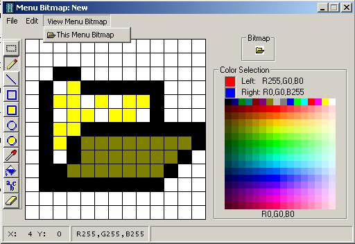



## MenuBitmaps

### Description

I recently got interested in adding bitmaps to menu items and found that the bitmaps have to be on the order of 13x13 (MS says 10x10 but these seem to work OK). Since I didn't have any readily available method to create such bitmaps, I came up with this little tool that may be of use. You can create 13x13's from scratch, size/crop from other pics (bmp,jpg,ico) or size/crop from clipboard. Included is the routine to actually assign the bitmaps to menu items, as you can see from the screenshot.
 
### More Info
 

             |
---                |---
**Submitted On**   |2007-02-04 10:43:06
**By**             |[Norm Cook](https://github.com/Planet-Source-Code/PSCIndex/blob/master/ByAuthor/norm-cook.md)
**Level**          |Intermediate
**User Rating**    |4.8 (24 globes from 5 users)
**Compatibility**  |VB 6\.0
**Category**       |[Graphics](https://github.com/Planet-Source-Code/PSCIndex/blob/master/ByCategory/graphics__1-46.md)
**World**          |[Visual Basic](https://github.com/Planet-Source-Code/PSCIndex/blob/master/ByWorld/visual-basic.md)
**Archive File**   |[MenuBitmap204623242007\.zip](https://github.com/Planet-Source-Code/norm-cook-menubitmaps__1-67787/archive/master.zip)

### API Declarations

A few in the bas module.

